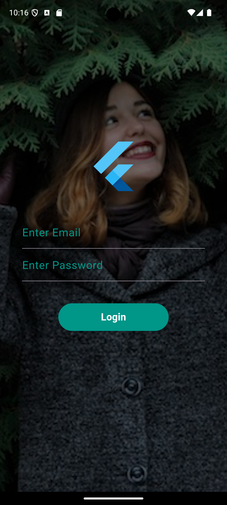

# Flutter Login Page App

This project demonstrates a simple login page built using **Flutter**. It features an animated logo, a dark-themed user interface, and a login form with email and password fields.

## Features:
- **Animated Flutter Logo**: The Flutter logo scales with a bounce effect upon entering the screen.
- **Login Form**: The form includes email and password input fields.
- **Dark Theme**: The app uses a dark background with teal accents to create a modern and elegant look.
- **Customizable UI**: The user interface is styled with rounded buttons and custom input fields to improve user experience.

## Project Structure:
This project follows a simple structure that is commonly used in Flutter applications. Below is an overview of the directory and file organization:

├── assets/
│   └── images/
│       └── girl.jpeg          # Background image used in the login screen
├── lib/
│   └── main.dart              # Main entry point for the app
└── pubspec.yaml               # Flutter project configuration file

### Files and Their Purpose:

- **assets/images/girl.jpeg**  
  This image is used as a background in the login page, with a dark overlay applied for better contrast and readability.

- **lib/main.dart**  
  Contains the main logic and UI of the app. It serves as the entry point where the app is initialized and the first screen is displayed.

- **pubspec.yaml**  
  The configuration file for the Flutter project. It defines the project dependencies, assets, and other settings required to build the app.

## Dependencies:

This project uses the following Flutter packages:

- `flutter/material.dart`: This is the default Flutter package that provides widgets and themes for building the user interface using Material Design.
- **No external dependencies**: This app does not use any external dependencies other than the Flutter SDK itself.

## Screenshots:

Here are some screenshots of the project:

### Screenshot 1

You can see how the UI looks when using the application.